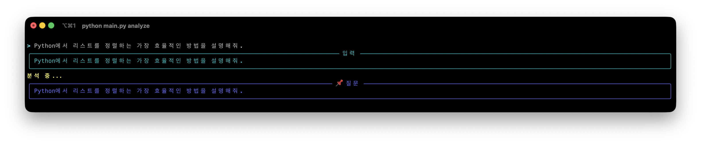
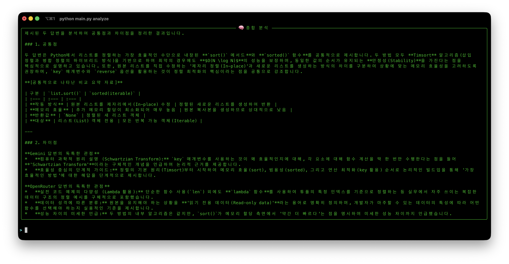
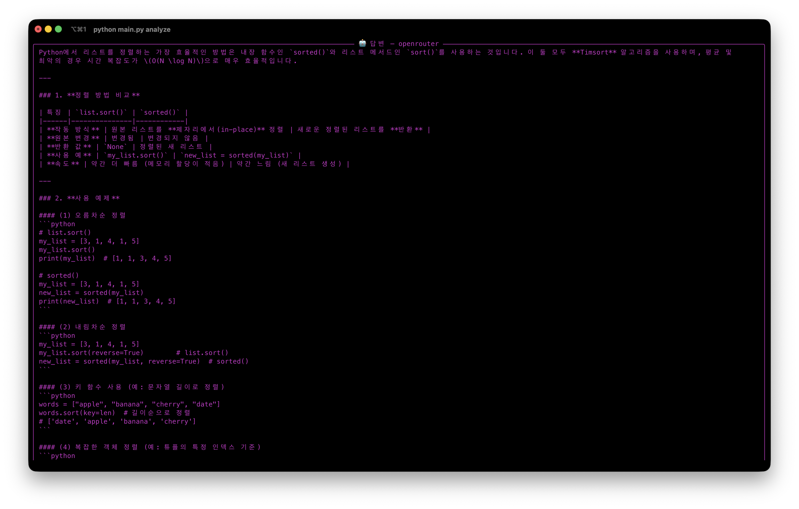
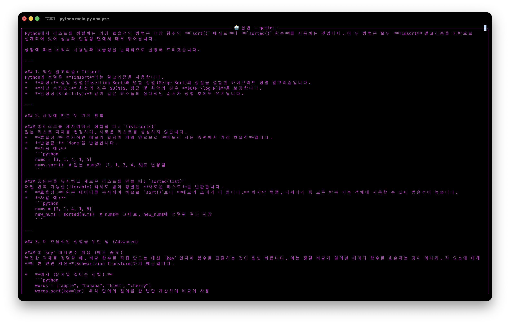

# llm-analyzer-cli

이 프로젝트는 여러 LLM에게 동시에 질문을 던지고, 그 답변들의 공통점과 차이점을 직관적으로 분석하는 도구입니다.  
단순히 LLM의 성능을 비교하는 것이 아니라, 다양한 관점의 차이를 명확하게 파악하는 데 초점을 맞추고 있습니다.  
이를 통해 한 번에 여러 LLM의 답변을 받아보고, 각기 다른 시각을 쉽게 확인할 수 있습니다.

## 🔹 예시 화면

### 1) 질문 예시



### 2) 분석 결과 예시



### 3) 개별 모델 답변 예시

  


## 설치 방법

```bash
git clone https://github.com/zooz13/llm-analyzer-cli.git
```

```bash
cd llm-analyzer-cli
python -m venv venv

source venv/bin/activate  # macOS/Linux
venv\Scripts\activate     # Windows
```

```
pip install -r requirements.txt
```

## 실행 방법

```bash
python main.py analyze "여기에 질문 입력"
```

## 참고

- .env 파일에 API 키 설정 필요 (예: OPENROUTER_API_KEY, GEMINI_API_KEY) `.env_example`을 참고하세요.

- 해당 프로젝트에서는 `gemini-3-flash-preview`, `mimo-v2-flash` 모델을 사용하고있습니다.
